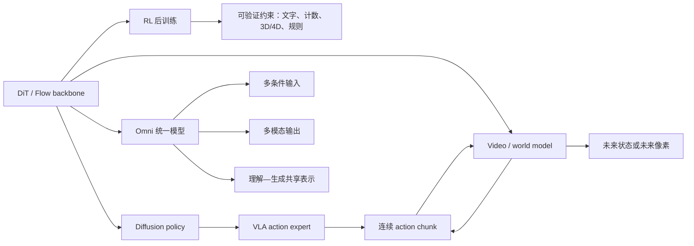

# 最近三年 DiT 研究版图

> 统计窗口：2023-08-02—2026-08-02。精选 128 篇窗口内论文，另列 17 篇更早的历史锚点。它是“问题结构采样”，不是 arXiv 关键词穷举。

## 一句话判断

DiT 的研究重心已经从“Transformer 能否替代 U-Net”转向“如何让连续生成模型具备更好的表示、更长的时间跨度、更低的系统成本，以及可通过 RL 和交互数据获得新能力”。

## 综述回填的历史链

依据 [Diffusion Models: A Comprehensive Survey of Methods and Applications](https://arxiv.org/abs/2209.00796) 回查后，主图谱补入 20 篇对 DiT 有直接方法意义的前置工作：DDPM / Score SDE 的生成基础，LDM 的 latent 与条件接口，DDIM / EDM / DPM-Solver / Progressive Distillation 的训练采样设计，Flow Matching / Rectified Flow 的连续流目标，Video Diffusion Models 的视频起点，以及 One Transformer Fits All、MMaDA 和早期 diffusion RL / preference alignment。纯垂直应用、普通 Transformer、扩散语言模型中的非多模态工作不纳入。

## 七条主线

| 主线 | 社区正在解决什么 | 代表工作 |
|---|---|---|
| 表示与架构 | 从 latent、flow 目标、多模态交互到线性注意力如何联合扩展 | PixArt-α/Σ、SiT、Stable Diffusion 3、SANA、REPA、RAE |
| 视频与长上下文 | token 数爆炸、长时漂移、训练—推理不一致、流式状态和音画/动作一致性 | W.A.L.T.、Latte、CogVideoX、HunyuanVideo、LTX-Video、SANA-Video |
| 系统效率 | 缓存误差、显存峰值与碎片、量化与稀疏协同、sequence parallel 通信、多 GPU 调度与混合模型 serving | DistriFusion、PipeFusion、xDiT、TeaCache、vLLM-Omni、Xema、X-Stage |
| RL 与奖励 | 从审美偏好扩展到文字、几何、3D/4D、物理和规则等可验证能力；降低 rollout 和 reward 成本 | DiffusionNFT、World-R1、VideoRLVR、DiT-Reward、JAGG |
| 世界模型与交互模拟 | 从视觉上可信走向动作因果可辨、长时记忆、实时交互和策略评测 | DIAMOND、GameNGen、Cosmos、WorldGym、COMBAT、dWorldEval |
| 具身智能与机器人控制 | 从 3D diffusion policy 扩展到通用 VLA action expert，同时解决跨本体、导航、触觉和实时闭环 | 3D Diffuser Actor、RDT-1B、π0/π0.5、CogACT、GR00T N1、NavDP |
| 原生多模态与 Omni | 区分多条件/多输出与真正的共享骨干、共享表示和联合预训练 | Transfusion、Show-o、JanusFlow、OmniFlow、BLIP3-o、BAGEL |

## 各方向成熟度

| 方向 | 研究热度 | 工程成熟度 | 判断 |
|---|---:|---:|---|
| Dense DiT / MMDiT 基础模型 | 高 | 高 | 仍是公开模型的主干 |
| 视频高效注意力与更强 VAE | 很高 | 中高 | 对成本最直接，正在快速产品化 |
| 缓存、量化、并行、调度 | 很高 | 中 | 收益强依赖模型、硬件、分辨率和 batch |
| DiT RL 后训练 | 很高 | 中低 | 目标明确，但 rollout、奖励和稳定性仍贵 |
| 交互世界模型 | 很高 | 低到中 | 实时游戏 demo 进展快，机器人闭环中的接触、反事实与长时可靠性仍不足 |
| 具身 Diffusion / Flow Policy | 很高 | 中 | action expert 已成为重要连续动作头，导航、3D 表示和实时部署正快速成熟 |
| 原生多模态理解—生成 | 很高 | 低到中 | AR + diffusion/flow 已形成多种共享骨干方案，目标冲突与评测仍未收敛 |
| 专家化 DiT | 中 | 低 | 存在不同路由粒度，公开部署资料仍少 |

## RL、World Model、Embodied AI、Agent workflow 和 DiT 的连接图

RL 是训练方法，world model 是可学习的环境转移，VLA 是感知—语言—动作策略接口，Agent workflow 是将规划、记忆、工具、验证与执行组织起来的闭环，Omni 则描述输入、输出和表示的统一范围。它们不是互斥架构。

## 阅读顺序

1. 先读 [基础模型、表示空间与架构](01_foundation_architecture.md)，理解 latent 和架构变化。
2. 再读 [视频与长上下文](02_video_long_context.md) 和 [系统效率](03_efficiency_systems.md)，看成本从哪里来。
3. 最后读 [RL](04_rl_alignment.md)、[Agent](05_agent_world_robotics.md)、[Omni](06_omni_unified.md)，把新能力与主干模型连接起来。
4. 如果要选研究题，直接看 [开放问题](07_open_questions.md)。
