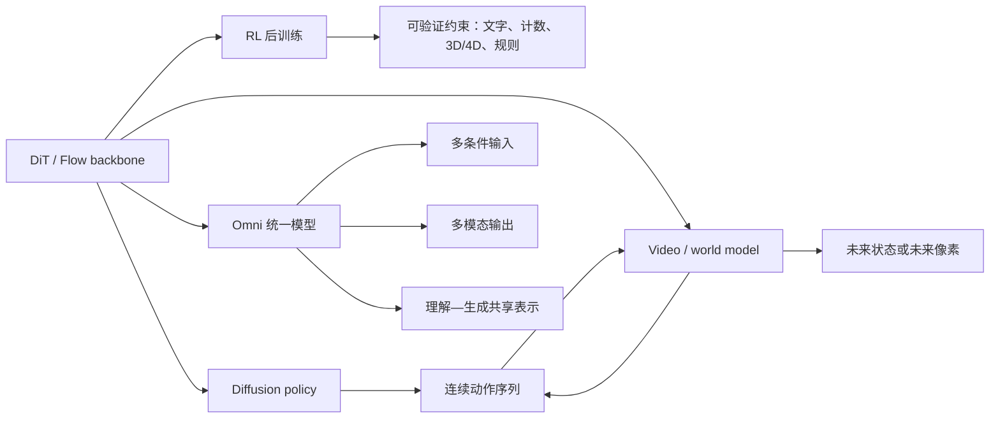

# 最近一年 DiT 研究版图

> 统计窗口：2025-08-02—2026-08-02。精选 47 篇窗口内论文，另列 8 篇窗口外背景锚点。它是“问题结构采样”，不是 arXiv 关键词穷举。

## 一句话判断

DiT 的研究重心已经从“Transformer 能否替代 U-Net”转向“如何让连续生成模型具备更好的表示、更长的时间跨度、更低的系统成本，以及可通过 RL 和交互数据获得新能力”。

## 六条主线

| 主线 | 社区正在解决什么 | 代表工作 |
|---|---|---|
| 表示与架构 | VAE latent 是否限制语义和细节；高维 RAE latent 如何扩散；单流、像素空间和混合模块怎样扩展 | RAE、Scaling RAE DiT、PixelDiT、Z-Image、Chimera |
| 视频与长上下文 | token 数爆炸、长时漂移、训练—推理不一致、流式状态和音画/动作一致性 | SANA-Video、Helios、Causal-rCM、SANA-Video 2.0 |
| 系统效率 | 缓存误差、量化与稀疏协同、sequence parallel 通信、多 GPU 调度与 kernel 落地 | QuantSparse、FlashOmni、SwiftFusion、GF-DiT、X-Stage |
| RL 与奖励 | 从审美偏好扩展到文字、几何、3D/4D、物理和规则等可验证能力；降低 rollout 和 reward 成本 | DiffusionNFT、World-R1、VideoRLVR、DiT-Reward、JAGG |
| Agent / World Model | DiT 既可作为动作 policy，也可作为未来视频/世界预测器；开始尝试联合 world + action | Tenma、DECO、Qwen-RobotWorld、AlayaWorld、WorldDiT |
| Omni / 统一模型 | 从“多条件图像生成”走向多输出、交错生成以及理解—生成共享连续表示 | 3MDiT、Loom、UniDDT、MMDiff、UniGP、Twins |

## 各方向成熟度

| 方向 | 研究热度 | 工程成熟度 | 判断 |
|---|---:|---:|---|
| Dense DiT / MMDiT 基础模型 | 高 | 高 | 仍是公开模型的主干 |
| 视频高效注意力与更强 VAE | 很高 | 中高 | 对成本最直接，正在快速产品化 |
| 缓存、量化、并行、调度 | 很高 | 中 | 收益强依赖模型、硬件、分辨率和 batch |
| DiT RL 后训练 | 很高 | 中低 | 目标明确，但 rollout、奖励和稳定性仍贵 |
| World Model + Action | 很高 | 低到中 | demo 进展快，闭环长时可靠性不足 |
| Omni 理解—生成统一 | 高 | 低到中 | “统一”的定义尚不一致 |
| 专家化 DiT | 中 | 低 | 存在不同路由粒度，公开部署资料仍少 |

## RL、Agent、Omni 和 DiT 的连接图

RL 是训练方法，Agent 是闭环使用方式，Omni 是模型输入/输出与表示的统一范围；它们不是三种互斥架构。一个 DiT world model 可以同时通过 RL 后训练、给 Agent 做规划，并接受多模态 Omni 条件。

## 阅读顺序

1. 先读 [基础模型、表示空间与架构](01_foundation_architecture.md)，理解 latent 和架构变化。
2. 再读 [视频与长上下文](02_video_long_context.md) 和 [系统效率](03_efficiency_systems.md)，看成本从哪里来。
3. 最后读 [RL](04_rl_alignment.md)、[Agent](05_agent_world_robotics.md)、[Omni](06_omni_unified.md)，把新能力与主干模型连接起来。
4. 如果要选研究题，直接看 [开放问题](07_open_questions.md)。
