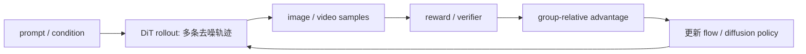

# RL、偏好对齐与可验证奖励

## RL 为什么在 DiT 上突然变热

监督微调只能模仿数据分布；RL 可以直接优化不可微或需要完整样本才能判断的目标。视觉生成最初常用审美、文本对齐 reward，最近一年正在转向更可验证的能力：文字是否拼对、物体是否数对、3D/4D 是否一致、动作是否满足物理或规则。

其基本闭环是：

## 代表进展

| 论文 | 奖励/方法重点 | DiT 关系 |
|---|---|---|
| Flow-GRPO（背景） | 把 online GRPO 适配到 flow matching | 已有 flow/DiT 的后训练框架 |
| DanceGRPO（背景） | 系统化视觉 GRPO、采样与稳定性 | 已有视觉生成器适配 |
| [DiffusionNFT](https://arxiv.org/abs/2509.16117) | 利用 forward process 做在线 diffusion RL | 解决探索/概率实现问题 |
| [VGGRPO](https://arxiv.org/abs/2603.26599) | 4D latent world-consistency reward | 视频结构能力训练 |
| [World-R1](https://arxiv.org/abs/2604.24764) | 3D constraints | 用几何规则提供可验证信号 |
| [VideoRLVR](https://arxiv.org/abs/2605.15458) | verifiable reward 下的视频推理 | 从偏好对齐走向规则能力 |
| [DiT-Reward](https://arxiv.org/abs/2606.23626) | 用生成 DiT 表征构建 reward model | 奖励模型与生成器表征对齐 |
| [JAGG](https://arxiv.org/abs/2607.17572) | Jacobian 聚合组梯度 | 降低长去噪轨迹估计代价 |
| [Spotlight](https://arxiv.org/abs/2606.19004) | seed exploration + spot GPU | 直接优化 rollout 系统成本 |

## 真正瓶颈

1. **rollout 贵**：每个 prompt 需要多个样本，每个样本又需要多步 DiT 前向；训练吞吐往往被采样而非反向传播支配。
2. **概率与梯度不自然**：flow/ODE 采样不是语言模型那样的离散自回归 policy，如何定义可用的 log-prob、加噪和 timestep credit 是方法差异核心。
3. **reward 容易被钻空子**：美学模型、VLM judge 或单一几何指标都可能被生成器 exploit；可验证不等于覆盖真实质量。
4. **长轨迹信用分配**：最终视频分数要分回很多去噪步与帧，方差高且内存重。
5. **多目标冲突**：提高文字/计数可能损伤多样性、审美或运动自然度，需要 Pareto 评测而非一个总分。

## 和 Agent 的关系

当 reward 是“任务是否成功”、world model 是否预测正确、机器人动作是否完成目标时，DiT RL 就从内容对齐进入 Agent policy optimization。但多数近期视觉论文仍是离线 prompt—sample—reward 闭环，离真实环境的在线长时交互还有一段距离。

## 建议阅读判断

- reward 是程序可验证、仿真器反馈，还是另一个学习模型的偏好？
- 是否报告 reward hacking 和分布外 prompt？
- 与 rejection sampling / best-of-N / supervised fine-tuning 的相同算力对比是否成立？
- rollout、reward 推理和训练各占多少时间？
- 论文改进的是优化器、奖励、采样器，还是系统调度？不要把四者混为一个“RL 增益”。
