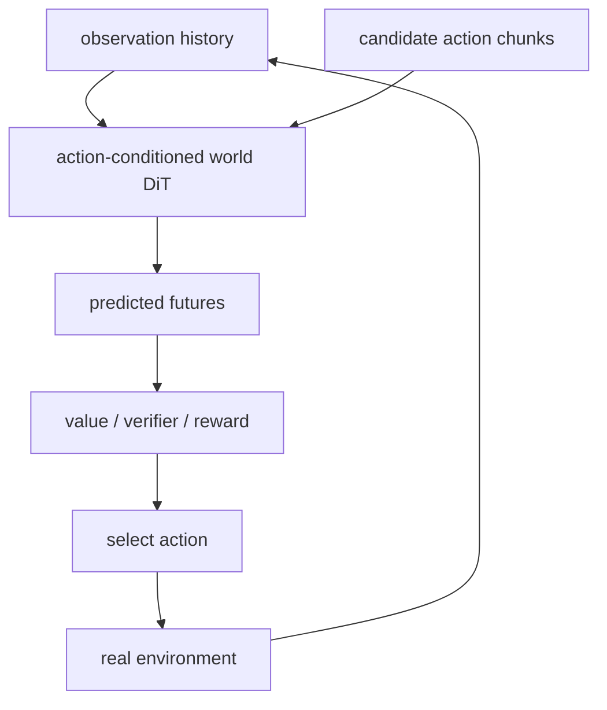

# Agent、World Model 与机器人

## 两种最清晰的结合方式

### DiT 作为动作 policy

输入观测、语言目标和机器人状态，输出一段连续动作轨迹。扩散 policy 的优势是能表达多峰动作分布，并一次生成 action chunk；缺点是多步去噪带来控制延迟，闭环频率和重规划成本高。

- [Tenma](../papers/05_agent_world_robotics/2509.11865__tenma.pdf)：跨 embodiment 操作，关注不同机器人动作空间与视觉语义共享。
- [U-DiT Policy](../papers/05_agent_world_robotics/2509.24579__u-dit-policy.pdf)：U 形多尺度 DiT 同时建模全局动作意图和局部控制。
- [DECO](../papers/05_agent_world_robotics/2602.05513__deco.pdf)：双手操作中解耦多模态路径，并以插件方式加入触觉。

### DiT 作为 world model

给定当前观测、语言和候选动作，预测未来视频或 latent state。优势是可以利用海量视频预训练并保留丰富场景细节；缺点是像素预测花费大量计算在与决策无关的纹理上，而且“看起来合理”不等于动力学可用于规划。

- [Qwen-RobotWorld](../papers/05_agent_world_robotics/2606.17030__qwen-robotworld.pdf)：以语言条件视频生成统一具身 world modeling。
- [AlayaWorld](../papers/05_agent_world_robotics/2607.18367__alayaworld.pdf)：强调 interactive、long-horizon 和实时连续性。
- [WorldDiT](../papers/05_agent_world_robotics/2607.23909__worlddit.pdf)：在同一 DiT 中统一 world 与 action modeling，是两条路线合流的直接代表。
- [WLA](../papers/05_agent_world_robotics/2606.05979__wla.pdf)：进一步把 language reasoning 放进 world-language-action 接口。

## 从视频生成到 Agent，不是只加一个 action condition

闭环后会出现四个视频生成 benchmark 很少覆盖的问题：

1. **反事实动作敏感性**：不同候选动作必须产生可区分、因果正确的未来。
2. **模型误差利用**：planner 会主动寻找 world model 的漏洞，而非被动接受随机样本。
3. **实时预算**：每个控制周期可能需要评估多条未来，DiT rollout 成本成倍放大。
4. **长期状态**：物体位置、库存、接触和任务进度不能只靠视觉风格一致性维持。

## 当前成熟度判断

DiT 已经是很有竞争力的短时动作生成器和高保真未来视频模型；但“通用 Agent 基础架构”仍是研究命题。近期工作更多证明统一建模可行，尚未普遍证明它在真实环境长时成功率、低延迟和样本效率上优于模块化 VLM + policy + state model。

最值得跟踪的是 world/action joint model、因果可控的可验证评测、少步/一步动作扩散，以及用 RL 让 planner 和 world model 在闭环中共同改进。

