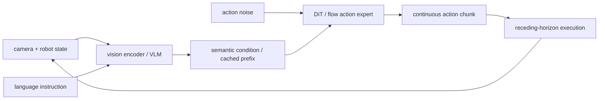
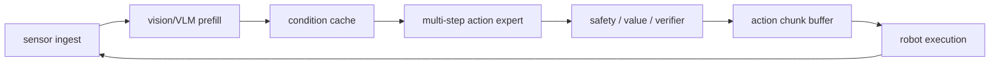
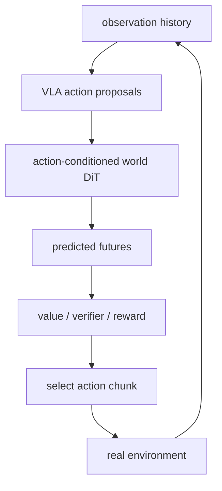
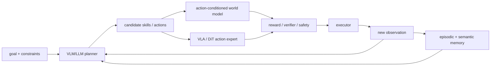

# 世界模型、具身智能与 Agent workflow

## 先分清三种角色

| 角色 | 典型输入 | 典型输出 | DiT / flow 的位置 |
|---|---|---|---|
| VLA policy | 图像、语言、机器人状态 | 连续 action chunk | action expert / diffusion policy |
| World model | 历史观测、语言、候选动作 | 未来视频或 latent state | video/world DiT |
| Agent / planner | 目标、状态、工具和模型反馈 | 子目标、候选动作、重规划决策 | 调用 policy/world model，不一定自身是 DiT |

这三者会组合，但研究问题不同。VLA 关心“现在该执行什么动作”；world model 关心“执行后会发生什么”；Agent 负责把两者放进闭环并管理长时任务。

## 世界模型正在解决的四类问题

| 问题 | 核心矛盾 | 代表工作 |
|---|---|---|
| 可交互视觉世界 | 画面真实不等于动作真的改变未来 | [DIAMOND](https://arxiv.org/abs/2405.12399)、[GameNGen](https://arxiv.org/abs/2408.14837)、[The Matrix](https://arxiv.org/abs/2412.03568) |
| 实时与流式生成 | 自回归历史越长，计算、误差和等待时间越大 | [Hunyuan-GameCraft](https://arxiv.org/abs/2506.17201)、[Matrix-Game 2.0](https://arxiv.org/abs/2508.13009)、[Yume-1.5](https://arxiv.org/abs/2512.22096)、[COMBAT](https://arxiv.org/abs/2603.00825) |
| 长时状态与记忆 | 有限 context 不能保存被遮挡物体、场景布局和任务进度 | [Video World Models with Long-term Spatial Memory](https://arxiv.org/abs/2506.05284)、[dWorldEval](https://arxiv.org/abs/2604.22152) |
| 策略评测与反事实 | 世界模型需要保持候选动作的相对结果，而不只是生成好看的平均未来 | [WorldGym](https://arxiv.org/abs/2506.00613)、[OSCAR](https://arxiv.org/abs/2606.04463)、[A2World](https://arxiv.org/abs/2606.29501)、[AV World-Action DiT](https://arxiv.org/abs/2606.12987) |

[Genie](https://arxiv.org/abs/2402.15391) 是重要的自回归对照：它表明潜动作可从无标注视频中学到，但并不代表 world model 必须使用 DiT。[Cosmos](https://arxiv.org/abs/2501.03575) 则把数据清洗、tokenizer、自回归/扩散骨干和后训练组织成 Physical AI 平台。

## 具身智能不只是 VLA

具身研究里 DiT/diffusion 至少有四个落点：

1. **动作分布**：Diffusion Policy、π0 等生成多峰连续 action chunk。
2. **3D 场景与位姿轨迹**：[3D Diffuser Actor](https://arxiv.org/abs/2402.10885) 用 3D 去噪 Transformer，[DP3](https://arxiv.org/abs/2403.03954) 说明简洁 3D 表示本身就能增强泛化。
3. **通用与跨本体策略**：[Octo](https://arxiv.org/abs/2405.12213) 是开源 Transformer 基线，[RDT-1B](https://arxiv.org/abs/2410.07864) 则把 Robotics Diffusion Transformer 扩展到 1.2B 参数和双臂操作。
4. **导航、探索与风险评估**：[NoMaD](https://arxiv.org/abs/2310.07896) 统一目标导航和无目标探索，[NavDP](https://arxiv.org/abs/2505.08712) 在同一 Transformer 里生成轨迹并评估危险。

## VLA 的主流 DiT 结合方式

当前最常见的结构并不是让 vLLM 直接生成连续动作，而是让预训练 VLM 提供语义条件，再由 diffusion/flow Transformer action expert 并行生成一段连续动作：

这条路线的优势是能表达多峰连续动作、一次生成 action chunk，并保持 VLM 的开放词汇语义；代价是 action expert 需要多步求解，感知变化后旧 chunk 会快速过期。

## 论文演进

### 方法基础与可扩展 action expert

- [Diffusion Policy](https://arxiv.org/abs/2303.04137)：用条件动作扩散、action chunk 和 receding-horizon control 建立方法基础；它是历史锚点，不等同于今天的大型 VLA。
- [Diffusion Transformer Policy](https://arxiv.org/abs/2410.15959)：直接用大型多模态 DiT 去噪连续动作，而不是只在 VLM 后接小 action head。
- [π0](https://arxiv.org/abs/2410.24164)：在 VLM 上叠加 flow-matching action expert，并以多 embodiment 数据训练通用机器人策略。
- [CogACT](https://arxiv.org/abs/2411.19650)：把 cognition backbone 与 diffusion action Transformer 组件化，系统研究动作模块的结构和 scaling。
- [DexVLA](https://arxiv.org/abs/2502.05855)：扩大可插拔 diffusion expert，并通过 embodiment curriculum 支持复杂、长时和跨机器人任务。
- [GR00T N1](https://arxiv.org/abs/2503.14734)：VLM System 2 负责理解，DiT System 1 负责实时连续控制，是双系统 VLA 的清晰实例。

### 泛化、联合训练与统一 diffusion

- [π0.5](https://arxiv.org/abs/2504.16054)：把机器人数据、网络数据、语义子任务和动作联合训练，重点从 benchmark 操作扩展到新环境长时任务。
- [SmolVLA](https://arxiv.org/abs/2506.01844)：以小模型、社区数据和异步推理降低训练与部署门槛。
- [dVLA](https://arxiv.org/abs/2509.25681)：在统一 diffusion 目标下连接视觉、语言推理和动作；其 diffusion language backbone 与传统视觉 DiT 不完全相同。
- [Dream-VLA](https://arxiv.org/abs/2512.22615)：利用 diffusion language model 的双向并行生成研究视觉规划与 action chunk。
- [VLAFlow](https://arxiv.org/abs/2607.01586)：固定 π0 风格架构，对照 action-only、语言协同训练和未来 latent 对齐，帮助分离训练目标与数据混杂因素。

### 专用机器人 DiT 与多模态控制

- [Tenma](https://arxiv.org/abs/2509.11865)：跨 embodiment 操作，关注不同机器人动作空间与视觉语义共享。
- [U-DiT Policy](https://arxiv.org/abs/2509.24579)：U 形多尺度 DiT 同时建模全局动作意图和局部控制。
- [DECO](https://arxiv.org/abs/2602.05513)：双手操作中解耦视觉、触觉和动作路径，并以插件方式加入触觉。

## VLA workflow 里可以做什么

### 1. 跨阶段调度

VLM prefill 通常是一次较重的语义计算，action expert 则在多个 solver step 中反复调用。可以研究两类 GPU 是否分离、不同机器人请求如何分别 batching、视觉 token 与条件 prefix 怎样在阶段间传输。vLLM-Omni 的 stage graph 提供了通用起点，但机器人 deadline 和控制状态仍需要专用调度。

### 2. 异步感知—控制

如果每次都等待“新图像 → 完整 VLM → 完整 denoising → 执行”，控制频率会被最慢阶段限制。SmolVLA 一类异步栈说明可以并行感知、预测和执行；仍需解决 stale observation、正在执行的 chunk 如何取消，以及新旧规划如何平滑接续。

### 3. action expert 加速

- 少步或一步 flow/consistency distillation；
- action/state-aware feature cache，而非只按 timestep 缓存；
- draft policy + 主模型验证，如 Realtime-VLA FLASH；
- VLM、视觉 token 与 DiT action head 的联合量化和结构化裁剪；
- batch-1、低功耗边缘设备上的专用 kernel 与 runtime。

相关系统工作包括 [EfficientVLA](https://arxiv.org/abs/2506.10100)、[QuantVLA](https://arxiv.org/abs/2602.20309)、[Realtime-VLA FLASH](https://arxiv.org/abs/2605.13778)、[vla.cpp](https://arxiv.org/abs/2606.08094) 和 [ActionCache](https://arxiv.org/abs/2607.06370)。

### 4. deadline-aware serving

普通生成服务可以让请求多等几十毫秒；机器人控制不行。调度目标应从平均吞吐改为 action deadline miss rate、p99 control latency、过期 chunk 比例和安全回退次数。还可研究端侧快速 policy、边缘主模型与云端 planner 的分层部署。

### 5. world model 与 VLA 联合

把候选 action chunk 送入 action-conditioned world model，再由 value/verifier 选择动作，可以增强规划；但每个控制周期要展开多条未来，使 DiT rollout 成本成倍增加。

[Qwen-RobotWorld](https://arxiv.org/abs/2606.17030) 和 [AlayaWorld](https://arxiv.org/abs/2607.18367) 代表 world-model 侧；[WLA](https://arxiv.org/abs/2606.05979) 与 [WorldDiT](https://arxiv.org/abs/2607.23909) 开始把 language、world 和 action 放进统一接口。

## Agent workflow 与 DiT 的真正交叉

Agent 本身不必须是 DiT。DiT 更常出现在 Agent 调用的两个高成本模块：一个生成连续动作，一个模拟候选动作后的未来。因此有价值的研究对象是整个闭环，而不是把“Agent”当成又一种生成架构。

[ADWM](https://arxiv.org/abs/2606.05558) 是这种 workflow 的清晰例子：LLM agent 先根据当前状态选择离散文本动作，扩散世界模型再生成下一个环境转移，两者交替 rollout，而不是一次扩散完整轨迹。

这个闭环中最值得做的问题包括：

- **异构调度**：LLM/VLM prefill、多步 DiT rollout、verifier 和执行器的 batch、延迟与 GPU 需求不同，如何在 stage graph 上联合调度。
- **计划时预算分配**：什么时候直接执行，什么时候为多个候选动作展开 world-model rollout，何时延长地平线。
- **状态新鲜度与中断**：在计划完成前环境可能已变化；需要取消过期 rollout、热启动新计划并安全衔接 action chunk。
- **模型偏差与规划器利用**：world model 在常规轨迹上看似准确，planner 仍可能专门选择它会预测错的动作。
- **记忆与可追溯性**：哪些真实转移、模拟未来、验证结果和失败经验应被写入长期记忆，以及如何区分真实观测与模型臆测。
- **恢复与安全回退**：verifier 不确定、模型超时或执行偏离时，Agent 应退到什么级别的快速 policy 或停止状态。

这些问题把 vLLM-Omni 一类多阶段 serving、VLA 实时控制和 world-model 规划连成一个系统研究方向。

## 评测不能只看离线成功率

最需要补齐的指标包括：

1. **端到端闭环延迟**：从传感器时间戳到动作真正下发，而不是只测 action head kernel。
2. **重规划新鲜度**：动作使用的观测有多旧；中断旧 chunk 后是否平滑、安全。
3. **动作多模态性**：少步蒸馏、cache 和量化是否把不同可行策略压成单一模式。
4. **跨 embodiment 泛化**：不同关节空间、控制频率和相机布局是否真共享同一动作表征。
5. **反事实正确性**：world model 对不同候选动作是否产生因果可区分的未来，而不只是视觉上合理。
6. **系统—任务联合 Pareto**：成功率、p99 latency、内存、能耗和安全回退应一起报告。

## 当前判断

Diffusion/flow action expert 已经是连续动作 VLA 的重要路线，但具身智能的研究范围还包括 3D 表示、导航探索、世界模型、策略评测与安全执行。近期最清晰的研究机会位于模型和系统的交界：少步动作生成、异步闭环、阶段化 serving、world-model rollout 预算分配、过期动作处理，以及可验证的反事实规划。
